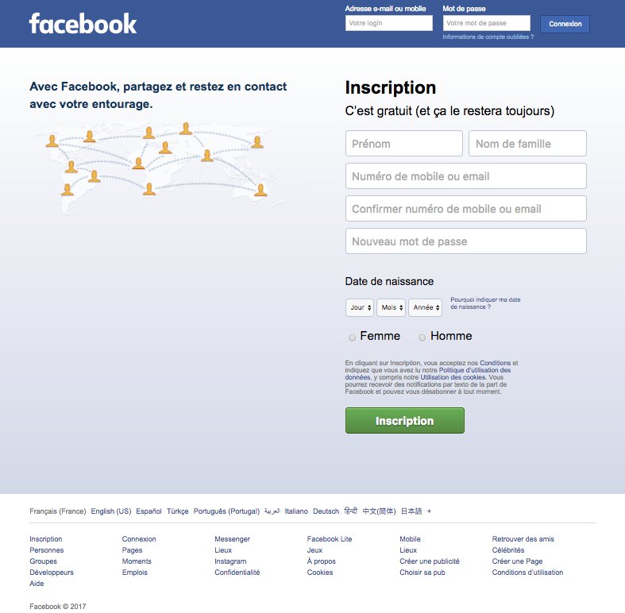

# JQUERYfblike
Projet réalisé dans le cadre de formations à la programmation web. Cet exercice reprend le design de la page de connexion/inscription de Facebook.

## Développement
Une requête Ajax en jQuery est présente dans ce projet, vous devez vous assuez de pouvoir l'ouvrir sur votre serveur local `http://localhost/`

### Présentation du projet
